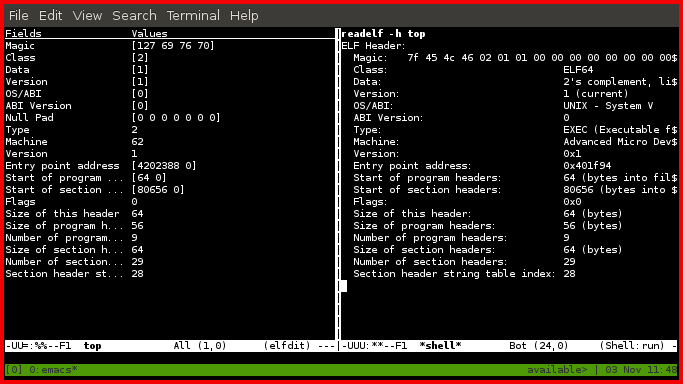

# elfdit-mode

Emacs major mode that was originally meant to edit the elf-header of a linux
executable.

# examples

\`M-x elfdit-mode'.  Example shows a comparison between elfdit-mode and readelf.
Note that the values for fields are decimal and not hexadecimal in elfdit.

# installation requirements

-   GNU Emacs 24.4.50.1

-   Open up elfdit.el in Emacs and \`M-x eval-buffer'.

# status

-   The original inspiration for this project, was an interest in understanding
    how permissions are defined for different regions of memory in a process.
    Eventually though I opted to just change the permission myself, using a hex
    editor.

-   Right now the major mode can only read and display the fields of an
    elf-header, so it mostly emulates \`readelf -h'.
